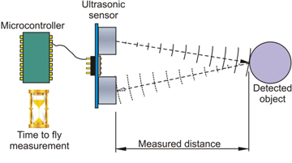
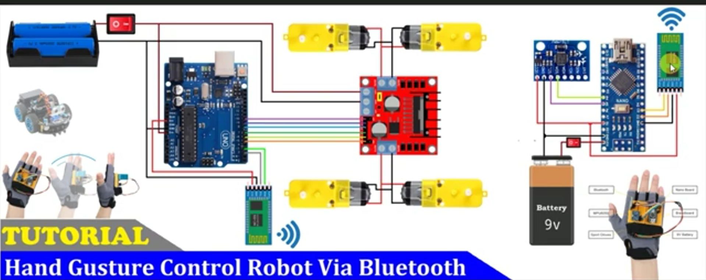

# <center> <font size=300> Gesture Controlled Robot </font> </center> 


&nbsp;&nbsp;&nbsp;&nbsp;My project is a small car that can be controlled with the movement of your hand. The user holds a board with an accelerometer, sensing tilt in 3 axes. Through Bluetooth, different signals are sent to the car, and based on these different inputs, the motor driver is given different amounts of power. The DC motors spin and move the car in different directions. An ultrasonic sensor at the front of the car detects obstacles and automatically stops the car when necessary to avoid collision.

<!---Replace this text with a brief description (2-3 sentences) of your project. This description should draw the reader in and make them interested in what you've built. You can include what the biggest challenges, takeaways, and triumphs from completing the project were. As you complete your portfolio, remember your audience is less familiar than you are with all that your project entails!-->


| **Engineer** | **School** | **Area of Interest** | **Grade** |
|:--:|:--:|:--:|:--:|
| Norrel A | Dougherty Valley High School | Mechanical Engineering | Incoming Freshman

<br>

<center>
<figure>
    
    <figcaption>Norrel A. Holding a PCB, 2024</figcaption>
</figure>
</center>

<center>
<figure>
    
    <figcaption>Norrel A. Holding his Gesture Controlled Robot, 2024</figcaption>
</figure>
</center>

# <center>Modification Milestone</center>
<center> 
<div style="border: 10px groove blue;">
<iframe width="560" height="315" src="https://www.youtube.com/embed/pXhIZNWV_w0" title="Norrel A. Modification" frameborder="0" allow="accelerometer; autoplay; clipboard-write; encrypted-media; gyroscope; picture-in-picture; web-share" referrerpolicy="strict-origin-when-cross-origin" allowfullscreen> </iframe> </div> </center>
&nbsp;&nbsp;&nbsp;&nbsp;For my modification milestone, I altered the turning method of my robot. Instead of rotating in place, it moves similarly to a normal car, turning slightly while moving forward or backward. I accomplished this by changing the speed of one side of the car when the turning signal is sent. The motor driver's ENA and ENB pins are wired to analog-write ports on the Arduino UNO board. Thus, I can give a value between 0 and 255: the motor driver interprets these signals as speed settings, changing the speed of the pin's respective side of the car. Next, I added an ultrasonic sensor to the front of the robot to detect any obstacles in front of it. It does this similar to how bats use echolocation to avoid collision while flying. When an object is detected at a certain distance, LOW signals are sent to all 4 DC motors, stopping the car automatically. 
<br>
<br>
<strong>Ultrasonic Car Code</strong>

```c++
digitalWrite(trigPin, LOW);
  delayMicroseconds(2);
  // Sets the trigPin on HIGH state for 10 micro seconds
  digitalWrite(trigPin, HIGH);
  delayMicroseconds(10);
  digitalWrite(trigPin, LOW);
  // Reads the echoPin, returns the sound wave travel time in microseconds
  duration = pulseIn(echoPin, HIGH, 500000);
  // Calculating the distance
  distance = duration * 0.034 / 2;
  // Prints the distance on the Serial Monitor
  //Serial.print("Distance: ");
  Serial.println(distance);
  if (distance < 30 && distance > 1 && blah==0) {
    crash = 1;
    crashStop();
  } else if (distance > 30) {
    crash = 0;
  }
```
&nbsp;&nbsp;&nbsp;&nbsp;On the controller board, I added an override button which sends a signal to the Arduino UNO, activating a function which disables the stopping feature of the robot. It does this by changing the state of a specific integer from 0 to 1, disabling a prerequisite for the stopping feature to activate. 
<br>
<br>
<strong>Override Controller Code</strong>
    
```c++
#include <SoftwareSerial.h>
SoftwwareSerial BT_Serial(3, 2);
#define button 7
void setup (){
Serial.begin(9600);
BT_Serial.begin(9600);
pinMode(button, INPUT_PULLUP);
}
void loop(){
int button_state = digitalRead(button);
if (button_state == 0 && AcX<60) {BT_Serial.write('o');}
}
```
<br>
<strong>Override Car Code</strong>

```c++
void loop() {
   while (BT_Serial.available()) {  //if some date is sent, reads it and saves in state
    bt_data = BT_Serial.read();
    Serial.println(bt_data);
  }
 if (bt_data == 'o' && crash == 1) {forword(); blah = 1; }
  else {blah=0;}
}
```
&nbsp;&nbsp;&nbsp;&nbsp;I installed a second button, which activates an emergency stop when held. Immediately, a stop signal is sent to the robot, and Bluetooth communication between the two devices is terminated indefinitely until both are reset. 
<br>
<br>
<strong>Emergency Stop Controller Code</strong>
```c++
#include <SoftwareSerial.h>
SoftwwareSerial BT_Serial(3, 2);
#define emergency 11
void setup (){
Serial.begin(9600);
BT_Serial.begin(9600);
pinMode(emergency, INPUT_PULLUP);
}
void loop(){
int emergency_state = digitalRead(emergency);
if (emergency_state == 0) {BT_Serial.write('z');}
}
```
<br>
<strong>Emergency Stop Car Code</strong>

```c++
void loop() {
   while (BT_Serial.available()) {  //if some date is sent, reads it and saves in state
    bt_data = BT_Serial.read();
    Serial.println(bt_data);
  }
  else if (bt_data == 'z') {crash == 1; crashStop(); BT_Serial.end();}
}
void crashStop(){
  digitalWrite(in1, LOW);  //Right Motor forword Pin
  digitalWrite(in2, LOW);  //Right Motor backword Pin
  digitalWrite(in3, LOW);  //Left Motor backword Pin
  digitalWrite(in4, LOW);  //Left Motor forword Pin
  blah = 0;
}
```

<center> <figure>
    
    <figcaption>L298N Motor Driver</figcaption>
</figure>
</center>
<center>
<figure>
    
    <figcaption>Ultrasonic Sensor Diagram</figcaption>
</figure>
</center>


# <center>Final Milestone</center> 

<center> 
<div style="border: 10px groove blue;">
<iframe width="560" height="315" src="https://www.youtube.com/embed/5ZlQGLkiJnY" title="Norrel A. Final Milestone" frameborder="0" allow="accelerometer; autoplay; clipboard-write; encrypted-media; gyroscope; picture-in-picture; web-share" referrerpolicy="strict-origin-when-cross-origin" allowfullscreen></iframe></div></center> 

&nbsp;&nbsp;&nbsp;&nbsp;For my final milestone, I fastened the top acrylic plate onto the chassis to protect the car's internal components. I used Velcro and hot glue to secure the H-bridge motor driver and Arduino UNO microcontroller to the car. I used tape to hold the battery and Bluetooth module in place. To complete my milestone, I made a bracelet out of a Velcro strap and taped my controller onto it. My biggest challenge at BSE was learning how to code with no previous experience. I had to look through multiple online tutorials and find the right one for my setup. Pairing the Bluetooth modules was also a  challenge as at first. I could not communicate with the setup through the serial monitor in the Arduino IDE. After a few more Google searches, I found that I had to remove the wires from the TX (transmitting) and RX (receiving) pins before pairing the two devices. I also misspelled some of the AT commands I sent to the master module. My biggest triumph at BSE was walking away from this camp  eager to learn more about software and programming robots in general. Throughout my time at this camp, I've gained experience in soldering, programming, and troubleshooting. I've learned about different electrical components such as Arduino UNO and NANO boards: I can identify analog, digital, ground, RX, and TX pins. After attending BSE, I hope to learn about machine learning and how artifical intelligence can be integrated with Arduino components. 

<!--- 
What you've accomplished since your previous milestone
- What your biggest challenges and triumphs were at BSE
- A summary of key topics you learned about
- What you hope to learn in the future after everything you've learned at BSE
-->


# <center>Second Milestone</center>


<center><div style="border: 10px groove blue;">
<iframe width="560" height="315" src="https://www.youtube.com/embed/DosaU0uHYiI" title="Norrel A. Second Milestone" frameborder="0" allow="accelerometer; autoplay; clipboard-write; encrypted-media; gyroscope; picture-in-picture; web-share" referrerpolicy="strict-origin-when-cross-origin" allowfullscreen></iframe></div></center>

&nbsp;&nbsp;&nbsp;&nbsp;For my second milestone, I've written the code for both the controller and car. For the controller, I added an accelerometer which reads the orientation of the board. Specifically, this accelerometer is a MEMS (microelectromechanical) accelerometer. Within the chip, there is a small mass suspended by springs, free to move around. When the board moves in any direction, the mass's change in position is recorded through a change in capacitance. This <a href="https://www.youtube.com/watch?v=MsyqsOUBQuU&t=285s"> video </a> will explain in furter detail how these chips work. 
<center> <figure>
    
    <figcaption>MPU6050 Accelerometer</figcaption>
</figure>
</center>
&nbsp;&nbsp;&nbsp;&nbsp;Through the serial monitor, it gives me X, Y, and Z values of degrees. This data is sent to the Arduino NANO board which compares the data to preset limitations to decide what signals to send. The signals are then transmitted through Bluetooth to the module on the car. 
<br>

<strong>Accelerometer Controller Code</strong>
```c++
#include <SoftwareSerial.h>
SoftwareSerial BT_Serial(3, 2); // RX, TX
#include <Wire.h> // I2C communication library
const int MPU = 0x68; // I2C address of the MPU6050 accelerometer
int16_t AcX, AcY, AcZ;

void setup () {// put your setup code here, to run once
Serial.begin(9600); // start serial communication at 9600bps
BT_Serial.begin(9600); 
// Initialize interface to the MPU6050
Wire.begin();
Wire.beginTransmission(MPU);
Wire.write(0x6B);
Wire.write(0);
Wire.endTransmission(true);

delay(500); 
}

void loop () {
Read_accelerometer(); // Read MPU6050 accelerometer
if(AcX<60) {BT_Serial.write('f');}
if(AcX>130){BT_Serial.write('b');}      
if(AcY<60){BT_Serial.write('l'); }
if(AcY>130){BT_Serial.write('r');}
if((AcX>70)&&(AcX<120)&&(AcY>70)&&(AcY<120)){BT_Serial.write('s'); }
}

void Read_accelerometer(){
      // Read the accelerometer data
Wire.beginTransmission(MPU);
Wire.write(0x3B); // Start with register 0x3B (ACCEL_XOUT_H)
Wire.endTransmission(false);
Wire.requestFrom(MPU, 6, true); // Read 6 registers total, each axis value is stored in 2 registers

AcX = Wire.read() << 8 | Wire.read(); // X-axis value
AcY = Wire.read() << 8 | Wire.read(); // Y-axis value
AcZ = Wire.read() << 8 | Wire.read(); // Z-axis value

AcX = map(AcX, -17000, 17000, 0, 180);
AcY = map(AcY, -17000, 17000, 0, 180);
AcZ = map(AcZ, -17000, 17000, 0, 180);

Serial.print(AcX);
Serial.print("\t");
Serial.print(AcY);
Serial.print("\t");
Serial.println(AcZ); 
}
```

&nbsp;&nbsp;&nbsp;&nbsp;The Arduino UNO interprets the incoming characters (F, B, L, R, etc.) and controls the L298N motor driver based on those inputs. In turn, the motor driver controls the speed and direction of all four DC motors. 
<br>
<br>
<strong>Car Code</strong>
```c++
#include <SoftwareSerial.h>
SoftwareSerial BT_Serial(3, 2);  // RX, TX
#define enA 10  //Enable1 L298 Pin enA
#define in1 9   //Motor1  L298 Pin in1
#define in2 8   //Motor1  L298 Pin in1
#define in3 7   //Motor2  L298 Pin in1
#define in4 6   //Motor2  L298 Pin in1
#define enB 5   //Enable2 L298 Pin enB
char bt_data;  // variable to receive data from the serial port
void setup() {         // put your setup code here, to run once
  Serial.begin(9600);  // start serial communication at 9600bps
  BT_Serial.begin(9600);
  pinMode(enA, OUTPUT);      // declare as output for L298 Pin enA
  pinMode(in1, OUTPUT);      // declare as output for L298 Pin in1
  pinMode(in2, OUTPUT);      // declare as output for L298 Pin in
  pinMode(in3, OUTPUT);      // declare as output for L298 Pin in3
  pinMode(in4, OUTPUT);      // declare as output for L298 Pin in4
  pinMode(enB, OUTPUT);      // declare as output for L298 Pin enB
  delay(200);
}
void loop() {
  while (BT_Serial.available()) {  //if some date is sent, reads it and saves in state
    bt_data = BT_Serial.read();
    Serial.println(bt_data);
  }
  if (bt_data == 'f') {
    forword();
  }  
  else if (bt_data == 'b') {
    backword();
  }  
  
  } else if (bt_data == 'l') {
    turnLeft();
  }  
  else if (bt_data == 'r') {
    turnRight();
}
  else if (bt_data == 's') { regularStop(); }  
  
}

void forword() {            //forword
  analogWrite(enB, 200);    // Write The Duty Cycle 0 to 255 Enable Pin A for Motor1 Speed
  analogWrite(enA, 200);    // Write The Duty Cycle 0 to 255 Enable Pin A for Motor1 Speed
  digitalWrite(in1, HIGH);  //Right Motor forword Pin
  digitalWrite(in2, LOW);   //Right Motor backword Pin
  digitalWrite(in3, LOW);   //Left Motor backword Pin
  digitalWrite(in4, HIGH);  //Left Motor forword Pin
}
void backword() {           //backword
  analogWrite(enB, 250);    // Write The Duty Cycle 0 to 255 Enable Pin A for Motor1 Speed
  analogWrite(enA, 250);    // Write The Duty Cycle 0 to 255 Enable Pin A for Motor1 Speed
  digitalWrite(in1, LOW);   //Right Motor forword Pin
  digitalWrite(in2, HIGH);  //Right Motor backword Pin
  digitalWrite(in3, HIGH);  //Left Motor backword Pin
  digitalWrite(in4, LOW);   //Left Motor forword Pin
}
void turnRight() {          //turnRight
  analogWrite(enB, 50);     // Write The Duty Cycle 0 to 255 Enable Pin A for Motor1 Speed
  analogWrite(enA, 250);    // Write The Duty Cycle 0 to 255 Enable Pin A for Motor1 Speed
  digitalWrite(in1, HIGH);  //Right Motor forword Pin
  digitalWrite(in2, LOW);   //Right Motor backword Pin
  digitalWrite(in3, LOW);   //Left Motor backword Pin
  digitalWrite(in4, HIGH);  //Left Motor forword Pin
}
void turnLeft() {           //turnLeft
  analogWrite(enA, 50);     // Write The Duty Cycle 0 to 255 Enable Pin A for Motor1 Speed
  analogWrite(enB, 250);    // Write The Duty Cycle 0 to 255 Enable Pin A for Motor1 Speed
  digitalWrite(in1, HIGH);  //Right Motor forword Pin
  digitalWrite(in2, LOW);   //Right Motor backword Pin
  digitalWrite(in3, LOW);   //Left Motor backword Pin
  digitalWrite(in4, HIGH);  //Left Motor forword Pin
}
void regularStop() {              //stop
  digitalWrite(in1, LOW);  //Right Motor forword Pin
  digitalWrite(in2, LOW);  //Right Motor backword Pin
  digitalWrite(in3, LOW);  //Left Motor backword Pin
  digitalWrite(in4, LOW);  //Left Motor forword Pin 
}
```


&nbsp;&nbsp;&nbsp;&nbsp;The first mistake I made was confusing the polarity of the motors, as because of this, my wheels were spinning inwards. I believed that the error was due to my code, and so, I spent the next hour looking over it, tweaking the HIGH and LOW digitalwrite values. Interestingly, my motors either continued to spin incorrectly or failed to spin at all. At last, I decided to rewire the motors, solving the problem. 


# <center>First Milestone</center>


<center><div style="border: 10px groove blue;">
<iframe width="560" height="315" src="https://www.youtube.com/embed/634PnCNzBaU" title="Norrel A. First Milestone" frameborder="0" allow="accelerometer; autoplay; clipboard-write; encrypted-media; gyroscope; picture-in-picture; web-share" referrerpolicy="strict-origin-when-cross-origin" allowfullscreen></iframe></div></center>

&nbsp;&nbsp;&nbsp;&nbsp;My project is the Gesture Controlled Robot. I chose this project as its unique method of input piqued my interest. I've finished assembling the hardware for both the car and the glove. I also connected the Bluetooth modules together through following a series of tutorials. The first challenge I encountered was a confusing plethora of tutorials offering me different ways to connect the H-bridge motor driver to the Arduino UNO. I ended up rewiring my setup as I decided to follow the original, long-winded tutorial instead. The second challenge I encountered was a lack of power: I needed to add a second power supply to keep all four DC motors running. When I connected the Bluetooth modules together, I had to stray away from the main tutorial once again. I used this <a href="https://www.instructables.com/Arduino-Two-Way-Communication-Via-Bluetooth-HC-05/"> tutorial </a> here, showing me how to configure each module as a master or slave. 
<br>
<br>
<strong>Pairing Slave Code</strong>
```c++
#include <SoftwareSerial.h>

SoftwareSerial Bluetooth(3,2);
void setup (){
  Serial.begin(9600);
  Bluetooth.begin(38400);
}

void loop() 
{
 //Read from HC-05 and send data to the Arduino Serial Monitor
 if (Bluetooth.available()){
 Serial.write(Bluetooth.read());
}
 //Read from Arduino Serial Monitor and send it to the HC-05
 if (Serial.available()){
  Bluetooth.write(Serial.read());
 }
}
```
<strong>Serial Monitor Commands</strong>
<br>
AT | OK | Check if the HC-05 is in AT Command mode
<br>
AT+ROLE=0 | OK | This makes the HC=05 a Slave
<br>
AT+ADDR? | <addr>, OK | Displays the HC-05's address
<br>
<br>
<strong>Pairing Master Code</strong>

```c++
#include <SoftwareSerial.h>

SoftwareSerial Bluetooth(3,2);
void setup (){
  Serial.begin(9600);
  Bluetooth.begin(38400);
}

void loop() 
{
 //Read from HC-05 and send data to the Arduino Serial Monitor
 if (Bluetooth.available()){
 Serial.write(Bluetooth.read());
}
 //Read from Arduino Serial Monitor and send it to the HC-05
 if (Serial.available()){
  Bluetooth.write(Serial.read());
 }
}

```
<strong>Serial Monitor Commands</strong>
<br>
AT | OK | Check if the HC-05 is in AT Command mode
<br>
AT+ROLE=1 | OK | This makes the HC-05 a Master
<br>
AT+CMODE=0 | OK | This allows the HC-05 connect to a specified address
<br>
AT+BIND=00<addr> | OK | When the HC-05 turns on, it will look for this address
<br>
<center> <figure>
    
    <figcaption>HC-05 Bluetooth Module</figcaption>
</figure>
</center>


# <center>Schematics</center>
<center> </center>
<center> </center>


# <center> Full Car Code (with Modifications) </center>

```c++

#include <SoftwareSerial.h>
SoftwareSerial BT_Serial(3, 2);  // RX, TX
#define enA 10  //Enable1 L298 Pin enA
#define in1 9   //Motor1  L298 Pin in1
#define in2 8   //Motor1  L298 Pin in1
#define in3 7   //Motor2  L298 Pin in1
#define in4 6   //Motor2  L298 Pin in1
#define enB 5   //Enable2 L298 Pin enB
#define light 11
const int trigPin = A5;
const int echoPin = A4;
long duration;
int distance;
char bt_data;  // variable to receive data from the serial port
int flag = 1;
int crash = 0;
int blah = 0;
void setup() {         // put your setup code here, to run once
  Serial.begin(9600);  // start serial communication at 9600bps
  BT_Serial.begin(9600);
  pinMode(enA, OUTPUT);      // declare as output for L298 Pin enA
  pinMode(in1, OUTPUT);      // declare as output for L298 Pin in1
  pinMode(in2, OUTPUT);      // declare as output for L298 Pin in
  pinMode(in3, OUTPUT);      // declare as output for L298 Pin in3
  pinMode(in4, OUTPUT);      // declare as output for L298 Pin in4
  pinMode(enB, OUTPUT);      // declare as output for L298 Pin enB
  pinMode(trigPin, OUTPUT);  // Sets the trigPin as an Output
  pinMode(echoPin, INPUT);   // Sets the echoPin as an Input
  pinMode(light, OUTPUT);
  delay(200);
}
void loop() {
  while (BT_Serial.available()) {  //if some date is sent, reads it and saves in state
    bt_data = BT_Serial.read();
    Serial.println(bt_data);
  }
  if (bt_data == 'f' && crash == 0) {
    forword();
    flag = 1;
  }  // if the bt_data is 'f' the DC motor will go forward
  else if (bt_data == 'b') {
    backword();
    flag = 0;
  }  // if the bt_data is 'b' the motor will Reverse
  else if (bt_data == 'l' && flag == 0) {
    backwardsleft();
  } else if (bt_data == 'r' && flag == 0) {
    BR();
  } else if (bt_data == 'l' && flag == 1 && crash == 0) {
    turnLeft();
    flag = 1;
  }  // if the bt_data is 'l' the motor will turn left
  else if (bt_data == 'r' && flag == 1 && crash == 0) {
    turnRight();
    flag = 1;
  }                                     // if the bt_data is 'r' the motor will turn right
  else if (bt_data == 's') { regularStop(); }  // if the bt_data 's' the motor will Stop
  else if (bt_data == 'z') {crash == 1; crashStop(); BT_Serial.end();}
  if (bt_data == 'k') {digitalWrite(light, HIGH); }
  else {digitalWrite(light, LOW);}
  if (bt_data == 'o' && crash == 1) {forword(); blah = 1; }
  else {blah=0;}
  digitalWrite(trigPin, LOW);
  delayMicroseconds(2);
  // Sets the trigPin on HIGH state for 10 micro seconds
  digitalWrite(trigPin, HIGH);
  delayMicroseconds(10);
  digitalWrite(trigPin, LOW);
  // Reads the echoPin, returns the sound wave travel time in microseconds
  duration = pulseIn(echoPin, HIGH, 500000);
  // Calculating the distance
  distance = duration * 0.034 / 2;
  // Prints the distance on the Serial Monitor
  //Serial.print("Distance: ");
  Serial.println(distance);
  if (distance < 30 && distance > 1 && blah==0) {
    crash = 1;
    crashStop();
  } else if (distance > 30) {
    crash = 0;
  }

}
void backwardsleft() {      //backwards then left
  analogWrite(enA, 50);     // Write The Duty Cycle 0 to 255 Enable Pin A for Motor1 Speed
  analogWrite(enB, 250);    // Write The Duty Cycle 0 to 255 Enable Pin A for Motor1 Speed
  digitalWrite(in1, LOW);   //Right Motor forword Pin
  digitalWrite(in2, HIGH);  //Right Motor backword Pin
  digitalWrite(in3, HIGH);  //Left Motor backword Pin
  digitalWrite(in4, LOW);   //Left Motor forword Pin
}
void BR() {                 //backwards then right
  analogWrite(enA, 250);    // Write The Duty Cycle 0 to 255 Enable Pin A for Motor1 Speed
  analogWrite(enB, 50);     // Write The Duty Cycle 0 to 255 Enable Pin A for Motor1 Speed
  digitalWrite(in1, LOW);   //Right Motor forword Pin
  digitalWrite(in2, HIGH);  //Right Motor backword Pin
  digitalWrite(in3, HIGH);  //Left Motor backword Pin
  digitalWrite(in4, LOW);   //Left Motor forword Pin
}
void forword() {            //forword
  analogWrite(enB, 200);    // Write The Duty Cycle 0 to 255 Enable Pin A for Motor1 Speed
  analogWrite(enA, 200);    // Write The Duty Cycle 0 to 255 Enable Pin A for Motor1 Speed
  digitalWrite(in1, HIGH);  //Right Motor forword Pin
  digitalWrite(in2, LOW);   //Right Motor backword Pin
  digitalWrite(in3, LOW);   //Left Motor backword Pin
  digitalWrite(in4, HIGH);  //Left Motor forword Pin
}
void backword() {           //backword
  analogWrite(enB, 250);    // Write The Duty Cycle 0 to 255 Enable Pin A for Motor1 Speed
  analogWrite(enA, 250);    // Write The Duty Cycle 0 to 255 Enable Pin A for Motor1 Speed
  digitalWrite(in1, LOW);   //Right Motor forword Pin
  digitalWrite(in2, HIGH);  //Right Motor backword Pin
  digitalWrite(in3, HIGH);  //Left Motor backword Pin
  digitalWrite(in4, LOW);   //Left Motor forword Pin
}
void turnRight() {          //turnRight
  analogWrite(enB, 50);     // Write The Duty Cycle 0 to 255 Enable Pin A for Motor1 Speed
  analogWrite(enA, 250);    // Write The Duty Cycle 0 to 255 Enable Pin A for Motor1 Speed
  digitalWrite(in1, HIGH);  //Right Motor forword Pin
  digitalWrite(in2, LOW);   //Right Motor backword Pin
  digitalWrite(in3, LOW);   //Left Motor backword Pin
  digitalWrite(in4, HIGH);  //Left Motor forword Pin
}
void turnLeft() {           //turnLeft
  analogWrite(enA, 50);     // Write The Duty Cycle 0 to 255 Enable Pin A for Motor1 Speed
  analogWrite(enB, 250);    // Write The Duty Cycle 0 to 255 Enable Pin A for Motor1 Speed
  digitalWrite(in1, HIGH);  //Right Motor forword Pin
  digitalWrite(in2, LOW);   //Right Motor backword Pin
  digitalWrite(in3, LOW);   //Left Motor backword Pin
  digitalWrite(in4, HIGH);  //Left Motor forword Pin
}
void regularStop() {              //stop
  digitalWrite(in1, LOW);  //Right Motor forword Pin
  digitalWrite(in2, LOW);  //Right Motor backword Pin
  digitalWrite(in3, LOW);  //Left Motor backword Pin
  digitalWrite(in4, LOW);  //Left Motor forword Pin 
}
void crashStop(){
  digitalWrite(in1, LOW);  //Right Motor forword Pin
  digitalWrite(in2, LOW);  //Right Motor backword Pin
  digitalWrite(in3, LOW);  //Left Motor backword Pin
  digitalWrite(in4, LOW);  //Left Motor forword Pin
  blah = 0; }

```
# <center> Full Controller Code (with Modifications) </center>
```c++
#include <SoftwareSerial.h>
SoftwareSerial BT_Serial(3, 2); // RX, TX
#include <Wire.h> // I2C communication library
const int MPU = 0x68; // I2C address of the MPU6050 accelerometer
int16_t AcX, AcY, AcZ;
int BIGBENBRAWLER = 1;
#define button 7
#define emergency 11
#define light 5
int shell = 0;

//int flag=0;

void setup () {// put your setup code here, to run once
Serial.begin(9600); // start serial communication at 9600bps
BT_Serial.begin(9600); 
pinMode(button, INPUT_PULLUP);
pinMode(emergency, INPUT_PULLUP);
pinMode(light, OUTPUT);
// Initialize interface to the MPU6050
Wire.begin();
Wire.beginTransmission(MPU);
Wire.write(0x6B);
Wire.write(0);
Wire.endTransmission(true);

delay(500); 
}

void loop () {
Read_accelerometer(); // Read MPU6050 accelerometer
if(AcX<60) {BT_Serial.write('f');}
int button_state = digitalRead(button);
if (button_state == 0 && AcX<60) {BT_Serial.write('o'); shell=1; digitalWrite(light, HIGH);}
if (button_state == 0 && shell == 0) {BT_Serial.write('k'); digitalWrite(light, HIGH);}

if (button_state == 1) {shell=0; digitalWrite(light, LOW);}

int emergency_state = digitalRead(emergency);
if (emergency_state == 0) {BT_Serial.write('z');}
if(AcX>130){BT_Serial.write('b');}      
if(AcY<60){BT_Serial.write('l'); }
if(AcY>130){BT_Serial.write('r');}
if((AcX>70)&&(AcX<120)&&(AcY>70)&&(AcY<120)){BT_Serial.write('s'); }
}

void Read_accelerometer(){
      // Read the accelerometer data
Wire.beginTransmission(MPU);
Wire.write(0x3B); // Start with register 0x3B (ACCEL_XOUT_H)
Wire.endTransmission(false);
Wire.requestFrom(MPU, 6, true); // Read 6 registers total, each axis value is stored in 2 registers

AcX = Wire.read() << 8 | Wire.read(); // X-axis value
AcY = Wire.read() << 8 | Wire.read(); // Y-axis value
AcZ = Wire.read() << 8 | Wire.read(); // Z-axis value

AcX = map(AcX, -17000, 17000, 0, 180);
AcY = map(AcY, -17000, 17000, 0, 180);
AcZ = map(AcZ, -17000, 17000, 0, 180);

Serial.print(AcX);
Serial.print("\t");
Serial.print(AcY);
Serial.print("\t");
Serial.println(AcZ); 
}
```

# <center>Bill of Materials</center>


| **Part** | **Note** | **Price** | **Link** |
|:--:|:--:|:--:|:--:|
| Arduino UNO | Contains the code for the vehicle | $29 | <a href="https://www.amazon.com/Arduino-A000066-ARDUINO-UNO-R3/dp/B008GRTSV6/"> Link </a> |
| Arduino Nano R3 | Contains the code for the glove | $25.10 | <a href="https://www.amazon.com/Arduino-A000005-ARDUINO-Nano/dp/B0097AU5OU/ref=sr_1_3?dib=eyJ2IjoiMSJ9.DuUAPNKOZx3V-ph33HzyN0M-73jcP_H0KcW1aHgUufhQ1KYdLDGa-NFC9DqAKMKBXhyIzngMftHvp0kBuo-NYOnbrtgpFBmZBW_-VRPz5TK1i2y1XPyp4i_CLeZ_SHYukLGyGIhA--MhDtuKa0-ytIkKxs9kwW5bmdW93o9_KWoPshi1meFCONTIBwBengTx1XTSiLjzTx8GnGs0Ez0p3ZzANtbdtbT1Qn2Hl5OHyvk.Z-zVstCWTJN8kdU7cRPxa7Je_gALYjIonkaAI9x956s&dib_tag=se&keywords=arduino+nano+r3&qid=1718407538&sr=8-3"> Link </a> |
| SparkFun Dual H-Bridge motor drivers L298 | Controls the motors' direction | $6.49 | <a href="https://www.amazon.com/Diymall-Module-Stepper-Modules-Arduino/dp/B00NJOTBOK/ref=asc_df_B00NJOTBOK/?tag=hyprod-20&linkCode=df0&hvadid=693611984328&hvpos=&hvnetw=g&hvrand=5328556088157619807&hvpone=&hvptwo=&hvqmt=&hvdev=c&hvdvcmdl=&hvlocint=&hvlocphy=9032183&hvtargid=pla-2062985254553&psc=1&mcid=170f1bbf2f773d04a1c0254ec6413a12&gad_source=1"> Link </a> |
| Solderless Breadboard Half Size | Base for the glove's electronics | $6.75 | <a href="https://www.amazon.com/BB400-Solderless-Plug-BreadBoard-tie-points/dp/B0040Z1ERO/ref=asc_df_B0040Z1ERO/?tag=hyprod-20&linkCode=df0&hvadid=693601911085&hvpos=&hvnetw=g&hvrand=15606954069564620041&hvpone=&hvptwo=&hvqmt=&hvdev=c&hvdvcmdl=&hvlocint=&hvlocphy=9032183&hvtargid=pla-638906394402&psc=1&mcid=df8a82d513d937b38ac19209b20d38be&gad_source=1"> Link </a> |
| HC-05 Bluetooth Module "(x2)" | Transmits signals between the glove and car | $10.39 | <a href="https://www.amazon.com/HiLetgo-Wireless-Bluetooth-Transceiver-Arduino/dp/B071YJG8DR"> Link </a> |
| DC Motor, 12 V and Wheels"(x4)" | Moves the vehicle | $10 | <a href="https://www.amazon.com/Gebildet-DC3V-12V-Four-Wheel-Robotic-Aircraft/dp/B08D39MFN1/ref=asc_df_B08D39MFN1/?tag=hyprod-20&linkCode=df0&hvadid=693361699609&hvpos=&hvnetw=g&hvrand=8936357447354879100&hvpone=&hvptwo=&hvqmt=&hvdev=c&hvdvcmdl=&hvlocint=&hvlocphy=9032043&hvtargid=pla-937905506568&mcid=e05d649e88bd3b5e8e847eb902e02f8b&gad_source=1&th=1"> Link </a> |
| Rocker Switch "(x2)" | Controls the flow of power | $2.75 | <a href="https://www.amazon.com/Switch-Black-Rocker-Rectangular-Opening/dp/B085XD1YQC/ref=asc_df_B085XD1YQC/?tag=hyprod-20&linkCode=df0&hvadid=693270340065&hvpos=&hvnetw=g&hvrand=18279408580620259037&hvpone=&hvptwo=&hvqmt=&hvdev=c&hvdvcmdl=&hvlocint=&hvlocphy=9032043&hvtargid=pla-2202285594162&psc=1&mcid=b63be441320c3457875ee1a1d02757de&gad_source=1"> Link </a> |
| Ultrasonic Sensor | Detects objects in front of it | $6.40 | <a href="https://www.amazon.com/HC-SR04-Ultrasonic-Distance-Measuring-MEGA2560/dp/B088BT8CDW/ref=asc_df_B088BT8CDW/?tag=hyprod-20&linkCode=df0&hvadid=692875362841&hvpos=&hvnetw=g&hvrand=16516956733224583183&hvpone=&hvptwo=&hvqmt=&hvdev=c&hvdvcmdl=&hvlocint=&hvlocphy=9032043&hvtargid=pla-2281435177618&psc=1&mcid=a96bc6df1ca933c4baf6476b09ca6103&hvocijid=16516956733224583183-B088BT8CDW-&hvexpln=73&gad_source=1"> Link </a> |
| 220 Ohm Resistor | Limits the current flowing to LED bulb | $0.25 | <a href="https://theelectronicgoldmine.com/products/t1001"> Link </a> |


# <center>Starter Project Milestone</center> 

<!---**Don't forget to replace the text below with the embedding for your milestone video. Go to Youtube, click Share -> Embed, and copy and paste the code to replace what's below.**-->
<center><div style="border: 10px groove blue;">
<iframe width="560" height="315" src="https://www.youtube.com/embed/nfM3Oaaae1E" title="Norrel A. Starter Project" frameborder="0" allow="accelerometer; autoplay; clipboard-write; encrypted-media; gyroscope; picture-in-picture; web-share" referrerpolicy="strict-origin-when-cross-origin" allowfullscreen></iframe></div></center> 

&nbsp;&nbsp;&nbsp;&nbsp;My starter project was the calculator. I chose this project as I thought it was a great way to practice soldering and assembly while also being useful. The first challenge I encountered was a lack of instructions, but the build was otherwise straightforward. I also damaged the STC chip during construction, so I had to repair it by soldering a small piece of wire to it. Moving forward, I will use the knowledge and experience I gained from this project to streamline the making of my main project. I highly recommend this starter project to incoming BlueStamp engineers as it nurtures critical thinking and proves an elegant desk piece. 

<!--
# Other Resources/Examples
One of the best parts about Github is that you can view how other people set up their own work. Here are some past BSE portfolios that are awesome examples. You can view how they set up their portfolio, and you can view their index.md files to understand how they implemented different portfolio components.
- [Example 1](https://trashytuber.github.io/YimingJiaBlueStamp/)
- [Example 2](https://sviatil0.github.io/Sviatoslav_BSE/)
- [Example 3](https://arneshkumar.github.io/arneshbluestamp/)

To watch the BSE tutorial on how to create a portfolio, click here. 
-->

# <center>References</center>
<center><a href="https://www.hackster.io/embeddedlab786/hand-gesture-control-robot-via-bluetooth-94b13d"> Main Tutorial </a></center> <br>
<center><a href="https://www.instructables.com/Arduino-Two-Way-Communication-Via-Bluetooth-HC-05/"> Bluetooth Tutorial </a></center> <br>
<center><a href="https://www.instructables.com/Interfacing-Buzzer-to-Arduino/"> Buzzer Connection Tutorial </a> </center><br>
<center><a href="https://howtomechatronics.com/tutorials/arduino/ultrasonic-sensor-hc-sr04/"> Ultrasonic Sensor Tutorial </a> </center><br>
<center><a href="https://newbiely.com/tutorials/arduino-nano/arduino-nano-button"> Button Tutorial </a></center> <br>
<center><a href="https://www.markdownguide.org/hacks/"> Github Design Tutorial </a></center> <br>


  
 


